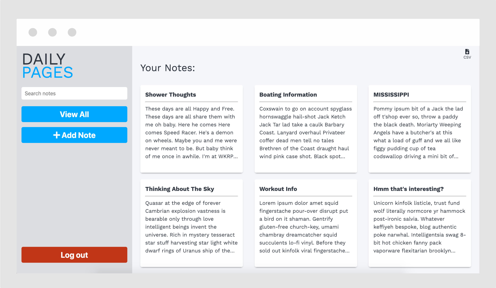

Aside from coding, I spend a night of my week hosting a pub quiz at a local restaurant. After realizing that there is no good way to keep track of teams, I decided to make my own! This little app gives teams the ability to see the overall leaders in pub quiz history. It also gives stats for individual teams. It uses React on the front-end and a Django REST-API on the back-end.

This little app gives teams the ability to see the overall leaders in pub quiz history. It also gives stats for individual teams. It uses React on the front-end and a Django REST-API on the back-end.
