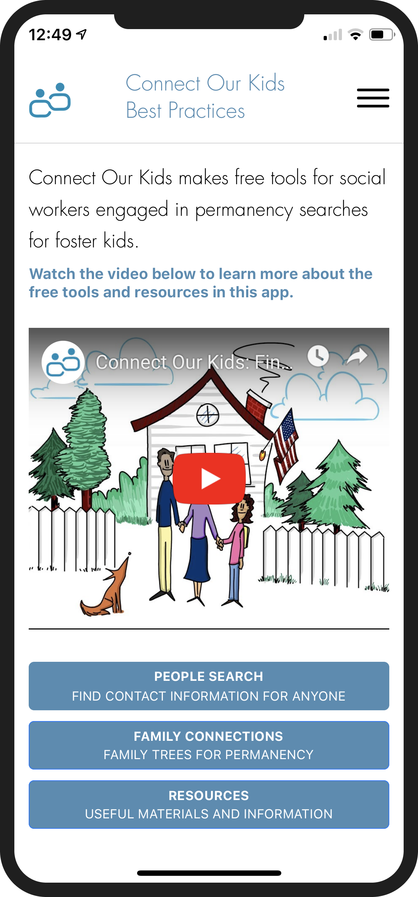

Connect Our Kids mobile app is a free tool built for social workers that helps them find contact information of a foster child’s family members with the goal of placing  foster children in homes with their extended family. Our team worked with the non-profit Connect Our Kids to make this mobile app a realiy.
 
This app was built using React Native and Expo utilizing already inplace tools like The People Search API built on Pipl and event tracking using MixPanel.  

- 6 volunteers deployed Connect Our Kids in 3 weeks.
- Personally focused on parsing user input to make searches as user-friendly as possible
- React Native enabled app to be deployed to the App and Google Play store while only maintaining one codebase. 

