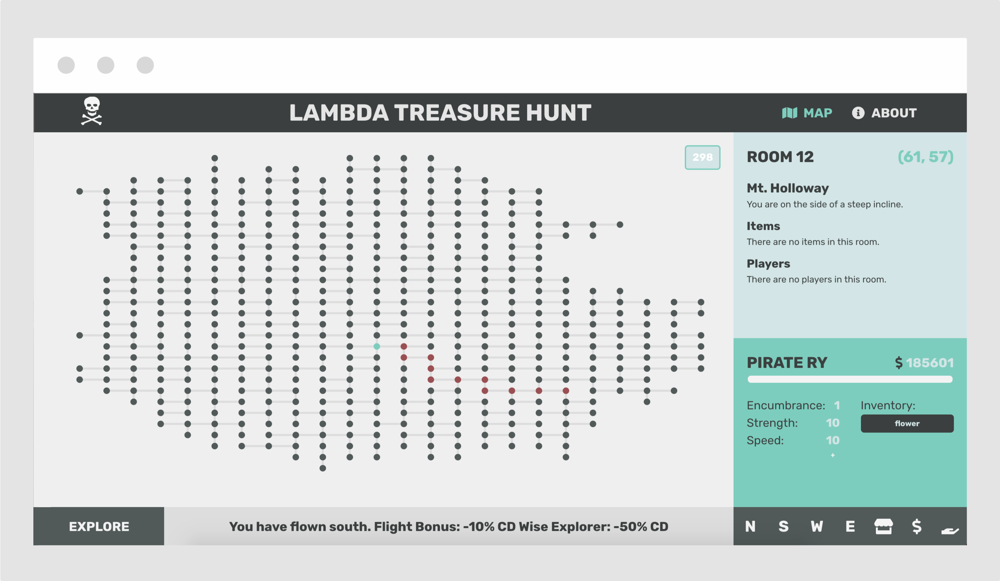

This project was part of a week-long MUD challenge at Lambda School. This app used different graph traversal algorithms in order to navigate the map. This project doubled as a competition to collect the most gold. I finished the week in third place!

- Built the project in just 5 days.
- Built out the UI using React.
- Built several API calls that took into account a buffer
- Wrote an algorithm to traverse the entire graph and then map it out in the UI
- Wrote several functions to make my player better - like the ability to fly!
